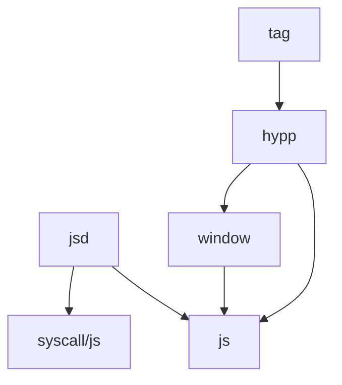

# Hypp

Hypp (pronounced `/haɪp/`, like 'hype') is a library for building user interfaces.
Its API is based on [Hyperapp](https://github.com/jorgebucaran/hyperapp).
Its name is a combination of the first two letters and last two letters of **Hy**pera**pp**.

## Tests

```shell
go test $(GOOS=js GOARCH=wasm go list ./... | grep -vE 'cmd/js|jsd')
```

## License

Hypp is published under the AGPL, which can be found [here](./LICENSE).

Hypp is derived from [Hyperapp](https://github.com/jorgebucaran/hyperapp).
Hyperapp is published under the MIT License which is included [here](./hyperapp/LICENSE.md).

Note that Hypp is NOT published under the MIT License.

## Development

Dependencies:

- [errcheck](https://github.com/kisielk/errcheck)
- [mockery](https://vektra.github.io/mockery/latest/)
- [staticcheck](https://staticcheck.dev/)

### Setup

Run the following to configure the git hooks.
This ensures everyone is using the same git hooks:

```shell
git config core.hooksPath ./hooks
```

The pre-commit hook will run the linters and tests.

### Package dependency graph

Below you'll find the package dependency graph.
Note that `jsd` depends on `syscall/js`, which only builds with `GOOS=js GOARCH=wasm`.


