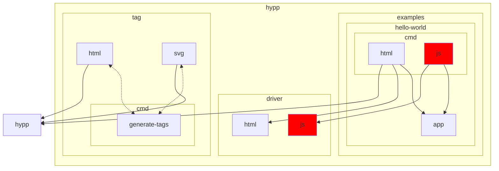
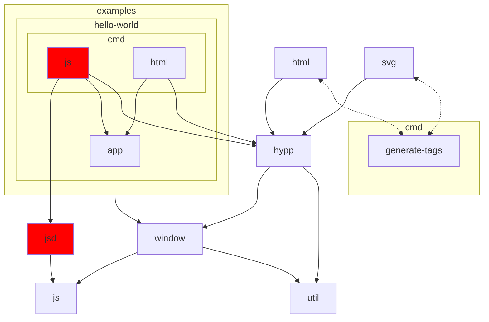

# Hypp

## Tests

```shell
$ go test . ./driver/html/... ./examples/.../app ./examples/.../html ./tag/...
```

## License

Hypp is published under the AGPL, which can be found [here](./LICENSE).

Hypp is derived from [Hyperapp](https://github.com/jorgebucaran/hyperapp).
Hyperapp is published under the MIT License which is included [here](./hyperapp/LICENSE.md).

Note that Hypp is NOT published under the MIT License.

## Development

Red nodes directly or indirectly import `syscall/js`.

Current package dependency graph:



Possible new package dependency graph:


