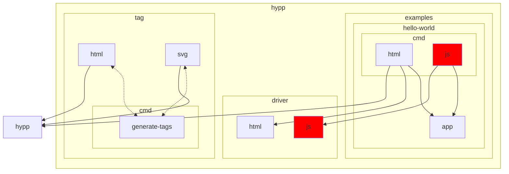

# Hypp

## Tests

```shell
go test $(go list ./... 2>/dev/null | grep -vE 'cmd|jsd')
```

## License

Hypp is published under the AGPL, which can be found [here](./LICENSE).

Hypp is derived from [Hyperapp](https://github.com/jorgebucaran/hyperapp).
Hyperapp is published under the MIT License which is included [here](./hyperapp/LICENSE.md).

Note that Hypp is NOT published under the MIT License.

## Development

Below you'll find the package dependency graph.
Red nodes directly or indirectly import `syscall/js`.


